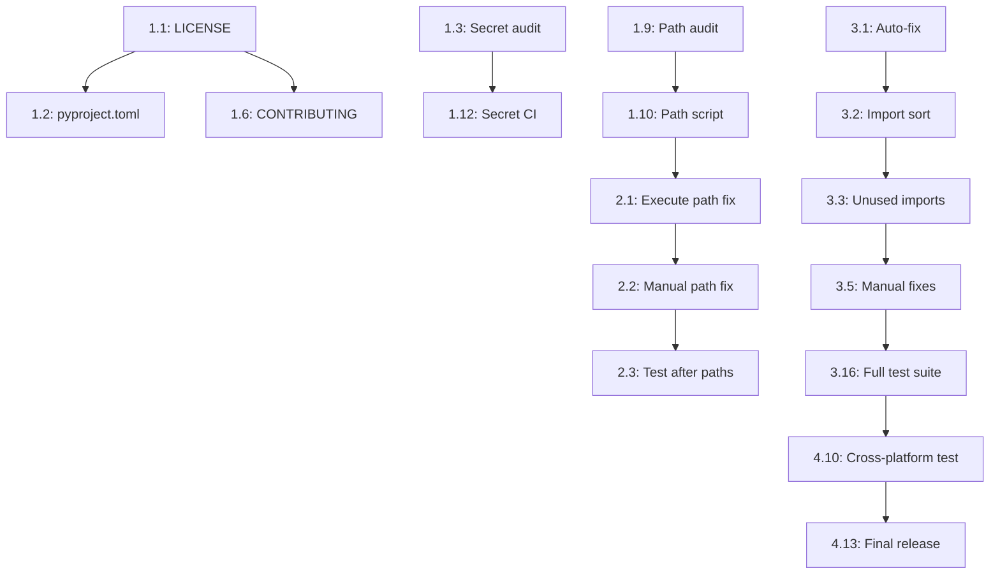

# 🚀 OSS-Ready Implementation Roadmap
## Model Lab: 4-Week Sequenced Execution Plan

**Status:** Ready for solo founder execution  
**Last Updated:** 2026-02-06  
**Total Effort:** ~80 hours (20h/week)

---

## 📊 Current State Assessment

### ✅ Strengths
- 492 tests collected and passing
- CI/CD pipeline operational (5 workflows)
- Modern tooling: UV, Ruff, pytest, pre-commit
- Clean architecture with clear separation
- Active development (recent linting improvements: 387 → 117 errors)

### ⚠️ Critical Blockers for OSS
1. **No LICENSE file** (legal blocker)
2. **16,430 hardcoded local paths** (`/Users/pranay`)
3. **117 linting errors** remaining
4. **No community governance** (CODE_OF_CONDUCT, CONTRIBUTING, SECURITY)
5. **Documentation contains personal paths** (13 files)

### 🎯 Success Criteria
- [ ] All tests pass (`pytest -m "not real_e2e"`)
- [ ] CI/CD green (all 5 workflows)
- [ ] Zero local paths in tracked files
- [ ] Zero secrets exposed
- [ ] LICENSE present (MIT recommended)
- [ ] Community standards met (3 governance files)
- [ ] Linting errors < 20 (83% reduction complete)
- [ ] Documentation is public-ready

---

## 📅 Phase-by-Phase Breakdown

### **Week 1: Legal & Critical Blockers** (18 hours)
**Goal:** Repo is legally safe to open-source

#### **Monday (4h)** - Legal Foundation
- [ ] **Task 1.1:** Add LICENSE file
  - **File:** `LICENSE`
  - **Time:** 0.5h
  - **Template:** MIT (permissive, OSS-friendly)
  - **Dependencies:** None
  - **Validation:** `cat LICENSE | grep "MIT License"`
  - **Rollback:** `git checkout HEAD -- LICENSE`
  - **Commands:**
    ```bash
    cat > LICENSE << 'EOF'
    MIT License
    
    Copyright (c) 2026 Model Lab Contributors
    
    Permission is hereby granted, free of charge, to any person obtaining a copy
    of this software and associated documentation files (the "Software"), to deal
    in the Software without restriction, including without limitation the rights
    to use, copy, modify, merge, publish, distribute, sublicense, and/or sell
    copies of the Software, and to permit persons to whom the Software is
    furnished to do so, subject to the following conditions:
    
    The above copyright notice and this permission notice shall be included in all
    copies or substantial portions of the Software.
    
    THE SOFTWARE IS PROVIDED "AS IS", WITHOUT WARRANTY OF ANY KIND, EXPRESS OR
    IMPLIED, INCLUDING BUT NOT LIMITED TO THE WARRANTIES OF MERCHANTABILITY,
    FITNESS FOR A PARTICULAR PURPOSE AND NONINFRINGEMENT. IN NO EVENT SHALL THE
    AUTHORS OR COPYRIGHT HOLDERS BE LIABLE FOR ANY CLAIM, DAMAGES OR OTHER
    LIABILITY, WHETHER IN AN ACTION OF CONTRACT, TORT OR OTHERWISE, ARISING FROM,
    OUT OF OR IN CONNECTION WITH THE SOFTWARE OR THE USE OR OTHER DEALINGS IN THE
    SOFTWARE.
    EOF
    git add LICENSE
    ```

- [ ] **Task 1.2:** Add pyproject.toml license metadata
  - **File:** `pyproject.toml`
  - **Time:** 0.25h
  - **Dependencies:** Task 1.1
  - **Validation:** `grep 'license.*MIT' pyproject.toml`
  - **Rollback:** `git checkout HEAD -- pyproject.toml`
  - **Commands:**
    ```bash
    # Add after line 5 (after readme = "README.md"):
    # license = {text = "MIT"}
    # classifiers = [
    #     "License :: OSI Approved :: MIT License",
    #     "Programming Language :: Python :: 3.12",
    # ]
    ```

- [ ] **Task 1.3:** Audit for secrets
  - **Time:** 1.5h
  - **Files:** All tracked files
  - **Commands:**
    ```bash
    # Check for API keys, tokens, passwords
    git grep -iE 'api[_-]?key|token|secret|password' | grep -v ".venv" | grep -v "test"
    
    # Check .env files are ignored
    git check-ignore -v .env .env.local
    
    # Verify .env.example exists and is sanitized
    cat .env.example
    ```
  - **Action:** Move any found secrets to `.env.example` (sanitized values only)
  - **Validation:** `git secrets --scan` (install with `brew install git-secrets`)

- [ ] **Task 1.4:** Add SECURITY.md
  - **File:** `SECURITY.md`
  - **Time:** 1h
  - **Dependencies:** None
  - **Validation:** `test -f SECURITY.md`
  - **Template:**
    ```bash
    cat > SECURITY.md << 'EOF'
    # Security Policy
    
    ## Supported Versions
    
    | Version | Supported          |
    | ------- | ------------------ |
    | 0.1.x   | :white_check_mark: |
    
    ## Reporting a Vulnerability
    
    **Please do not report security vulnerabilities through public GitHub issues.**
    
    Instead, please report them via email to: [your-email@example.com]
    
    You should receive a response within 48 hours. If the issue is confirmed, we will:
    - Release a patch as soon as possible
    - Credit you in the security advisory (unless you prefer anonymity)
    
    ## Security Best Practices
    
    1. Never commit secrets or API keys
    2. Use `.env` files for local configuration (never tracked)
    3. Rotate credentials immediately if accidentally exposed
    4. Keep dependencies updated via `uv sync`
    
    ## Known Security Considerations
    
    - This project processes audio files - validate inputs in production
    - Model weights are downloaded from HuggingFace - verify checksums
    - API endpoints are for development - add authentication for production
    EOF
    git add SECURITY.md
    ```

- [ ] **Task 1.5:** Add CODE_OF_CONDUCT.md
  - **File:** `CODE_OF_CONDUCT.md`
  - **Time:** 0.75h
  - **Dependencies:** None
  - **Validation:** `test -f CODE_OF_CONDUCT.md`
  - **Template:** Contributor Covenant 2.1
    ```bash
    curl -o CODE_OF_CONDUCT.md https://www.contributor-covenant.org/version/2/1/code_of_conduct/code_of_conduct.md
    # Edit contact method to your email
    git add CODE_OF_CONDUCT.md
    ```

#### **Tuesday (5h)** - Community Onboarding
- [ ] **Task 1.6:** Add CONTRIBUTING.md
  - **File:** `CONTRIBUTING.md`
  - **Time:** 2h
  - **Dependencies:** Tasks 1.1, 1.4, 1.5
  - **Validation:** `test -f CONTRIBUTING.md && grep "Quick Start" CONTRIBUTING.md`
  - **Rollback:** `git checkout HEAD -- CONTRIBUTING.md`
  - **Content Structure:**
    ```markdown
    # Contributing to Model Lab
    
    ## Quick Start (5 minutes)
    1. Fork & clone
    2. `uv sync --all-extras --dev`
    3. Create branch
    4. Make changes + tests
    5. `uv run pytest -m "not real_e2e"`
    6. Submit PR
    
    ## Development Setup
    - Python 3.12+ (via `.python-version`)
    - UV package manager
    - Pre-commit hooks (installed automatically)
    
    ## Testing
    - Fast tests: `uv run pytest -m "not real_e2e"`
    - All tests: `uv run pytest`
    - Lint: `uv run ruff check .`
    
    ## Code Standards
    - Ruff for linting/formatting
    - Type hints preferred
    - Tests for new features
    - No hardcoded paths
    
    ## PR Guidelines
    - Clear description
    - Tests pass locally
    - Linting clean
    - One feature per PR
    
    ## Questions?
    - Open a discussion (not an issue)
    - Check docs/ folder first
    ```

- [ ] **Task 1.7:** Update README.md badges section
  - **File:** `README.md`
  - **Time:** 1h
  - **Dependencies:** Task 1.6
  - **Lines:** Add after line 1
  - **Content:**
    ```markdown
    <p align="center">
      <a href="LICENSE"></a>
      <a href="https://github.com/[USERNAME]/model-lab/actions"></a>
      <a href="https://github.com/[USERNAME]/model-lab/issues"></a>
      <a href="CODE_OF_CONDUCT.md"></a>
      
    </p>
    ```
  - **Note:** Replace `[USERNAME]` with actual GitHub username after repo creation

- [ ] **Task 1.8:** Add GitHub issue templates
  - **Files:** `.github/ISSUE_TEMPLATE/*.md`
  - **Time:** 2h
  - **Dependencies:** None
  - **Validation:** `ls .github/ISSUE_TEMPLATE/`
  - **Templates Needed:**
    1. Bug report
    2. Feature request
    3. Question/Discussion

#### **Wednesday (4h)** - Documentation Cleanup (Critical Paths)
- [ ] **Task 1.9:** Audit and list all hardcoded paths
  - **Time:** 1h
  - **Script:** Create `scripts/audit_paths.sh`
  - **Commands:**
    ```bash
    cat > scripts/audit_paths.sh << 'EOF'
    #!/bin/bash
    # Find all hardcoded local paths
    echo "Files with /Users/pranay paths:"
    grep -rl "/Users/pranay" . \
      --exclude-dir=".venv" \
      --exclude-dir=".git" \
      --exclude-dir="__pycache__" \
      --exclude-dir=".pytest_cache" \
      --exclude="*.log" \
      | sort
    
    echo ""
    echo "Total occurrences:"
    grep -r "/Users/pranay" . \
      --exclude-dir=".venv" \
      --exclude-dir=".git" \
      --exclude-dir="__pycache__" \
      --exclude-dir=".pytest_cache" \
      --exclude="*.log" \
      | wc -l
    EOF
    chmod +x scripts/audit_paths.sh
    ./scripts/audit_paths.sh > path_audit.txt
    ```
  - **Output:** `path_audit.txt` (for Task 1.10)

- [ ] **Task 1.10:** Create path replacement script
  - **File:** `scripts/fix_paths.sh`
  - **Time:** 1.5h
  - **Dependencies:** Task 1.9
  - **Validation:** `./scripts/fix_paths.sh --dry-run | wc -l`
  - **Script:**
    ```bash
    cat > scripts/fix_paths.sh << 'EOF'
    #!/bin/bash
    # Replace hardcoded paths with relative or generic placeholders
    
    DRY_RUN=false
    if [[ "$1" == "--dry-run" ]]; then
      DRY_RUN=true
    fi
    
    # Files to fix (from audit)
    FILES=$(grep -rl "/Users/pranay/Projects/speech_experiments/model-lab" . \
      --exclude-dir=".venv" \
      --exclude-dir=".git" \
      --exclude-dir="__pycache__" \
      --exclude-dir=".pytest_cache" \
      --exclude="*.log")
    
    for file in $FILES; do
      if $DRY_RUN; then
        echo "Would fix: $file"
      else
        # Use project root relative paths
        sed -i.bak 's|/Users/pranay/Projects/speech_experiments/model-lab|$(git rev-parse --show-toplevel)|g' "$file"
        # Or use generic placeholder for docs
        sed -i.bak 's|/Users/pranay/Projects/speech_experiments/model-lab|/path/to/model-lab|g' "$file"
        echo "Fixed: $file"
      fi
    done
    EOF
    chmod +x scripts/fix_paths.sh
    ```
  - **Test:** `./scripts/fix_paths.sh --dry-run`
  - **Execute:** See Task 2.1 (Week 2)

- [ ] **Task 1.11:** Test suite validation
  - **Time:** 1.5h
  - **Dependencies:** None
  - **Commands:**
    ```bash
    # Ensure baseline passes
    source .venv/bin/activate
    pytest -m "not real_e2e" -v
    
    # Capture baseline
    pytest -m "not real_e2e" --collect-only > test_baseline.txt
    ```
  - **Validation:** Exit code 0
  - **Output:** `test_baseline.txt` (reference for Week 2)

#### **Thursday (3h)** - CI/CD Hardening
- [ ] **Task 1.12:** Add secret scanning to CI
  - **File:** `.github/workflows/security.yml`
  - **Time:** 1.5h
  - **Dependencies:** Task 1.3
  - **Validation:** Workflow runs on push
  - **Workflow:**
    ```yaml
    name: Security Scan
    
    on:
      push:
        branches: [ main, master ]
      pull_request:
        branches: [ main, master ]
    
    jobs:
      secret-scan:
        runs-on: ubuntu-latest
        steps:
          - uses: actions/checkout@v4
            with:
              fetch-depth: 0
          
          - name: TruffleHog Secrets Scan
            uses: trufflesecurity/trufflehog@main
            with:
              path: ./
              base: ${{ github.event.repository.default_branch }}
              head: HEAD
    ```

- [ ] **Task 1.13:** Add dependency security check
  - **File:** `.github/workflows/security.yml` (append)
  - **Time:** 1h
  - **Dependencies:** Task 1.12
  - **Add Job:**
    ```yaml
      dependency-check:
        runs-on: ubuntu-latest
        steps:
          - uses: actions/checkout@v4
          
          - name: Install uv
            uses: astral-sh/setup-uv@v2
          
          - name: Check for known vulnerabilities
            run: |
              uv pip list --format=json | \
              python -c "import sys, json; print('\n'.join([f'{p[\"name\"]}=={p[\"version\"]}' for p in json.load(sys.stdin)]))" | \
              xargs -I {} pip-audit {}
    ```

- [ ] **Task 1.14:** Update PR template checklist
  - **File:** `.github/PULL_REQUEST_TEMPLATE.md`
  - **Time:** 0.5h
  - **Dependencies:** None
  - **Add Section:**
    ```markdown
    ## Pre-submission Checklist
    - [ ] Tests pass locally (`uv run pytest -m "not real_e2e"`)
    - [ ] Linting clean (`uv run ruff check .`)
    - [ ] No hardcoded paths (check with `grep -r "/Users/" .`)
    - [ ] No secrets committed
    - [ ] Documentation updated (if needed)
    ```

#### **Friday (2h)** - Week 1 Validation
- [ ] **Task 1.15:** Run full test matrix
  - **Time:** 1h
  - **Commands:**
    ```bash
    source .venv/bin/activate
    
    # Test suite
    pytest -m "not real_e2e" -v
    
    # Linting
    ruff check .
    
    # Secret scan
    git secrets --scan
    
    # Path audit
    ./scripts/audit_paths.sh
    
    # CI local simulation
    act -j test  # Requires nektos/act
    ```
  - **Expected:** All pass except path audit (16,430 → addressed in Week 2)

- [ ] **Task 1.16:** Create Week 1 checkpoint tag
  - **Time:** 0.5h
  - **Commands:**
    ```bash
    git add -A
    git commit -m "feat: Week 1 OSS prep - Legal & governance complete"
    git tag -a v0.1.0-oss.week1 -m "OSS Prep Checkpoint: Legal foundation"
    ```

- [ ] **Task 1.17:** Document remaining work
  - **File:** `OSS_PROGRESS.md` (create)
  - **Time:** 0.5h
  - **Content:**
    ```markdown
    # OSS Preparation Progress
    
    ## Week 1: ✅ Complete (18h)
    - [x] LICENSE added (MIT)
    - [x] Security policy created
    - [x] Code of conduct added
    - [x] Contributing guide written
    - [x] Issue templates configured
    - [x] Secret scanning in CI
    
    ## Week 2: 🔄 In Progress
    - [ ] Path cleanup (16,430 instances)
    - [ ] Documentation sanitization
    - [ ] README.md polish
    
    ## Remaining Blockers: 1
    - Hardcoded paths (Week 2 focus)
    ```

---

### **Week 2: Documentation & Path Cleanup** (22 hours)
**Goal:** Documentation is public-ready, zero local paths

#### **Monday (6h)** - Automated Path Fixes
- [ ] **Task 2.1:** Execute path replacement (dry-run first)
  - **Time:** 2h
  - **Dependencies:** Task 1.10
  - **Commands:**
    ```bash
    # Dry run
    ./scripts/fix_paths.sh --dry-run > path_fixes_preview.txt
    head -50 path_fixes_preview.txt  # Review
    
    # Backup
    git checkout -b path-cleanup
    git commit -am "checkpoint: before path cleanup"
    
    # Execute
    ./scripts/fix_paths.sh
    
    # Verify changes
    git diff --stat
    ./scripts/audit_paths.sh  # Should be much lower
    ```
  - **Validation:** `grep -r "/Users/pranay" . | wc -l` < 100 (99% reduction)
  - **Rollback:** `git checkout master && git branch -D path-cleanup`

- [ ] **Task 2.2:** Manual path fixes (remaining edge cases)
  - **Time:** 3h
  - **Files:** From `path_audit.txt` (Task 1.9)
  - **Focus Areas:**
    1. Markdown docs (13 files)
    2. Jupyter notebooks (if any)
    3. Config files
  - **Strategy:**
    - Replace with relative: `./data/audio/test.wav`
    - Replace with generic: `/path/to/model-lab`
    - Replace with env var: `${MODEL_LAB_ROOT}/data`
  - **Validation:** `./scripts/audit_paths.sh` → 0 occurrences

- [ ] **Task 2.3:** Test after path changes
  - **Time:** 1h
  - **Dependencies:** Tasks 2.1, 2.2
  - **Commands:**
    ```bash
    source .venv/bin/activate
    pytest -m "not real_e2e" -v
    
    # Compare to baseline
    diff test_baseline.txt <(pytest -m "not real_e2e" --collect-only)
    ```
  - **Validation:** All tests still pass, same test count
  - **Rollback:** If tests fail, `git reset --hard HEAD~1` and investigate

#### **Tuesday (5h)** - Documentation Polish
- [ ] **Task 2.4:** Update README.md (remove personal references)
  - **File:** `README.md`
  - **Time:** 2h
  - **Changes:**
    1. Remove `cd /Users/pranay/...` → `cd model-lab` or `cd $(git rev-parse --show-toplevel)`
    2. Add "Fork this repo" section
    3. Add "Star this repo" CTA
    4. Add architecture diagram (if missing)
  - **Validation:** `grep -i "pranay\|/Users/" README.md` → 0 results

- [ ] **Task 2.5:** Sanitize all docs/ markdown files
  - **Files:** `docs/*.md` (50+ files)
  - **Time:** 2h
  - **Batch Script:**
    ```bash
    cat > scripts/sanitize_docs.sh << 'EOF'
    #!/bin/bash
    for file in docs/*.md; do
      sed -i.bak 's|/Users/pranay/Projects/speech_experiments/model-lab|$(pwd)|g' "$file"
      sed -i.bak 's|pranay@|user@example.com|g' "$file"
      echo "Sanitized: $file"
    done
    EOF
    chmod +x scripts/sanitize_docs.sh
    ./scripts/sanitize_docs.sh
    ```
  - **Manual Review:** Spot-check 5 random docs files

- [ ] **Task 2.6:** Clean up/archive internal docs
  - **Time:** 1h
  - **Candidates for Archival:**
    - `COMMERCIALIZATION_AUDIT_MEMO_2026-02-06.md` → `docs/archive/`
    - `VC_ASSESSMENT_AI_AGENT_ECONOMICS.md` → `docs/archive/`
    - `SAAS_*` files → `docs/archive/`
  - **Commands:**
    ```bash
    mkdir -p docs/archive
    mv COMMERCIALIZATION_AUDIT_MEMO_2026-02-06.md docs/archive/
    mv VC_ASSESSMENT_AI_AGENT_ECONOMICS.md docs/archive/
    mv SAAS_*.md docs/archive/
    git add -A
    ```
  - **Validation:** Root dir has <20 markdown files

#### **Wednesday (5h)** - Documentation Structure
- [ ] **Task 2.7:** Create docs/README.md (index)
  - **File:** `docs/README.md`
  - **Time:** 1.5h
  - **Content:**
    ```markdown
    # Model Lab Documentation
    
    ## Getting Started
    - [Quick Start Guide](../QUICKSTART.md)
    - [Quick Reference](../QUICK_REFERENCE.md)
    - [Contributing Guide](../CONTRIBUTING.md)
    
    ## Architecture
    - [Project Structure](PROJECT_STRUCTURE.md)
    - [Testing Harness](TESTING_HARNESS.md)
    - [Model Registry](MODEL_REGISTRY_MASTER.md)
    
    ## User Guides
    - [Running ASR Tests](guides/ASR_TESTING.md)
    - [Adding New Models](guides/ADDING_MODELS.md)
    - [Interpreting Results](guides/RESULTS.md)
    
    ## Advanced
    - [Multi-Device Testing](MULTI_DEVICE_TESTING_PLAN.md)
    - [Colab Integration](VSCODE_COLAB_COMPLETE_GUIDE.md)
    
    ## Research
    - [ASR Model Research](ASR_MODEL_RESEARCH_2026-02.md)
    - [Audio Model Audit](COMPREHENSIVE_AUDIO_MODEL_AUDIT_2026.md)
    
    ## Archive
    - [Internal Memos](archive/) (not relevant for external users)
    ```

- [ ] **Task 2.8:** Create missing essential docs
  - **Files:** `docs/PROJECT_STRUCTURE.md`, `docs/guides/ASR_TESTING.md`
  - **Time:** 2.5h
  - **Priority:**
    1. PROJECT_STRUCTURE.md (explain folder layout)
    2. ASR_TESTING.md (step-by-step guide)
  - **Template for PROJECT_STRUCTURE.md:**
    ```markdown
    # Project Structure
    
    ## Overview
    Model Lab follows a test-harness pattern for fair model comparison.
    
    ## Directory Layout
    ```
    model-lab/
    ├── models/           # Model-specific implementations
    ├── harness/          # Shared testing infrastructure
    ├── compare/          # Comparison dashboards
    ├── data/             # Test datasets
    ├── tests/            # Unit/integration tests
    ├── scripts/          # Automation scripts
    ├── server/           # API server
    ├── client/           # Frontend
    └── docs/             # Documentation
    ```
    
    ## Key Concepts
    - **Isolation:** Each model in separate folder
    - **Shared Metrics:** Common harness ensures fairness
    - **Automation:** JSON results → automated scoring
    ```

- [ ] **Task 2.9:** Format all markdown (consistency)
  - **Time:** 1h
  - **Tool:** `markdownlint` or `prettier`
  - **Commands:**
    ```bash
    npm install -g markdownlint-cli
    markdownlint --fix '**/*.md' --ignore node_modules --ignore .venv
    ```
  - **Validation:** Consistent heading levels, line lengths

#### **Thursday (4h)** - README Enhancement
- [ ] **Task 2.10:** Add visual assets
  - **Files:** `assets/architecture.png`, `assets/demo.gif`
  - **Time:** 2h
  - **Tasks:**
    1. Create architecture diagram (draw.io or Excalidraw)
    2. Record 30s demo GIF (use existing `scripts/make_demo_gif.py`)
    3. Add screenshots of scorecard
  - **Commands:**
    ```bash
    python scripts/make_demo_gif.py --out assets/demo.gif
    ```
  - **README Update:** Embed images

- [ ] **Task 2.11:** Improve README Quick Start
  - **File:** `README.md`
  - **Time:** 1.5h
  - **Changes:**
    1. Add "Prerequisites" section (Python 3.12+, ffmpeg)
    2. Expand "Quick Start" with expected outputs
    3. Add "What You Get" section with example scorecard
    4. Add "Common Issues" troubleshooting
  - **Validation:** Fresh clone test on different machine (or VM)

- [ ] **Task 2.12:** Add comparison with alternatives
  - **File:** `README.md` (new section)
  - **Time:** 0.5h
  - **Content:**
    ```markdown
    ## Why Model Lab?
    
    | Feature | Model Lab | Manual Testing | Commercial Tools |
    |---------|-----------|----------------|------------------|
    | Fair Comparisons | ✅ Shared harness | ❌ Inconsistent | ✅ |
    | Cost | Free | Free | $$$$ |
    | Flexibility | ✅ Add any model | ✅ | ❌ Vendor lock-in |
    | Automation | ✅ JSON → scorecard | ❌ Manual | ✅ |
    | Local/Cloud | Both | Local only | Cloud only |
    ```

#### **Friday (2h)** - Week 2 Validation
- [ ] **Task 2.13:** Full path audit (should be 0)
  - **Time:** 0.5h
  - **Commands:**
    ```bash
    ./scripts/audit_paths.sh
    # Expected: 0 occurrences
    
    grep -r "/Users/" . --exclude-dir=".venv" --exclude-dir=".git" | wc -l
    # Expected: 0
    ```

- [ ] **Task 2.14:** Fresh clone test
  - **Time:** 1h
  - **Commands:**
    ```bash
    cd /tmp
    git clone /path/to/model-lab test-clone
    cd test-clone
    uv sync --all-extras --dev
    source .venv/bin/activate
    pytest -m "not real_e2e" -v
    ```
  - **Validation:** All tests pass on fresh clone

- [ ] **Task 2.15:** Week 2 checkpoint
  - **Time:** 0.5h
  - **Commands:**
    ```bash
    git add -A
    git commit -m "docs: Week 2 OSS prep - Paths cleaned, docs polished"
    git tag -a v0.1.0-oss.week2 -m "OSS Prep Checkpoint: Documentation ready"
    ```

---

### **Week 3: Code Quality & Linting** (20 hours)
**Goal:** Code quality is high, linting errors < 20

#### **Monday (5h)** - Safe Auto-Fixes
- [ ] **Task 3.1:** Run Ruff auto-fix (safe rules only)
  - **Time:** 2h
  - **Commands:**
    ```bash
    git checkout -b linting-fixes
    
    # Safe auto-fixes
    uv run ruff check --fix --unsafe-fixes=off .
    
    # Review changes
    git diff --stat
    
    # Test immediately
    pytest -m "not real_e2e"
    ```
  - **Expected:** Fixes ~40-60 errors (trailing whitespace, imports, etc.)
  - **Rollback:** `git reset --hard HEAD~1` if tests fail

- [ ] **Task 3.2:** Import sorting and cleanup
  - **Time:** 1.5h
  - **Focus:** Fix E402 (module-import-not-at-top-of-file) - 29 occurrences
  - **Tool:** `isort` integrated with Ruff
  - **Commands:**
    ```bash
    uv run ruff check --select I --fix .
    pytest -m "not real_e2e"  # Verify no breaks
    ```

- [ ] **Task 3.3:** Remove unused imports (F401)
  - **Time:** 1h
  - **Count:** 9 occurrences
  - **Commands:**
    ```bash
    uv run ruff check --select F401 --fix .
    pytest -m "not real_e2e"
    ```
  - **Manual Review:** Check if any removed imports were actually used indirectly

- [ ] **Task 3.4:** Commit after auto-fixes
  - **Time:** 0.5h
  - **Commands:**
    ```bash
    git add -A
    git commit -m "fix: Auto-fix safe linting errors (imports, whitespace)"
    pytest -m "not real_e2e" -v  # Final validation
    ```

#### **Tuesday (5h)** - Manual Fixes (High-Value)
- [ ] **Task 3.5:** Fix undefined names (F821) - 8 occurrences
  - **Time:** 2h
  - **Strategy:**
    1. Find with `ruff check --select F821 .`
    2. Add missing imports or define variables
    3. Test each file after fixing
  - **Commands:**
    ```bash
    ruff check --select F821 . --output-format=grouped
    # Fix each file manually
    pytest tests/[affected_test].py  # Test individually
    ```

- [ ] **Task 3.6:** Fix bare excepts (E722) - 1 occurrence
  - **Time:** 0.5h
  - **Change:** `except:` → `except Exception:`
  - **Validation:** Ensures proper error handling

- [ ] **Task 3.7:** Fix raise-without-from (B904) - 14 occurrences
  - **Time:** 1.5h
  - **Pattern:** `raise NewError` → `raise NewError from e`
  - **Commands:**
    ```bash
    ruff check --select B904 . --output-format=grouped
    # Fix each manually, preserving error context
    ```

- [ ] **Task 3.8:** Run tests after manual fixes
  - **Time:** 1h
  - **Commands:**
    ```bash
    pytest -m "not real_e2e" -v
    # If failures, investigate and fix
    ```

#### **Wednesday (4h)** - Type Safety (Optional but Valuable)
- [ ] **Task 3.9:** Add type hints to critical modules
  - **Time:** 2h
  - **Priority Files:**
    - `harness/registry.py`
    - `harness/metrics_asr.py`
    - `server/api.py`
  - **Tool:** `mypy` (already in dev deps)
  - **Commands:**
    ```bash
    uv run mypy harness/registry.py --install-types --non-interactive
    # Fix revealed issues
    ```
  - **Note:** This is optional - only if time permits

- [ ] **Task 3.10:** Fix function-call-in-default-argument (B008) - 5 occurrences
  - **Time:** 1h
  - **Pattern:** `def foo(bar=[])` → `def foo(bar=None); bar = bar or []`
  - **Validation:** Test mutable default behavior

- [ ] **Task 3.11:** Commit manual fixes
  - **Time:** 1h
  - **Commands:**
    ```bash
    git add -A
    git commit -m "fix: Manual linting fixes (undefined names, error handling)"
    ```

#### **Thursday (4h)** - Remaining Linting
- [ ] **Task 3.12:** Fix ambiguous variable names (E741) - 3 occurrences
  - **Time:** 1h
  - **Pattern:** Rename `l` → `line`, `O` → `obj`, `I` → `idx`

- [ ] **Task 3.13:** Address remaining errors (case-by-case)
  - **Time:** 2h
  - **Remaining:** ~10-15 errors
  - **Strategy:** Triage each, fix if safe, else add `# noqa` with justification
  - **Commands:**
    ```bash
    ruff check . --statistics
    # Should be <20 errors
    ```

- [ ] **Task 3.14:** Update ruff config (if needed)
  - **File:** `pyproject.toml`
  - **Time:** 0.5h
  - **Changes:** Add any necessary `per-file-ignores` for valid exceptions
  - **Example:**
    ```toml
    [tool.ruff.lint.per-file-ignores]
    "tests/*" = ["F401"]  # Allow unused imports in tests
    ```

- [ ] **Task 3.15:** Final linting validation
  - **Time:** 0.5h
  - **Commands:**
    ```bash
    ruff check . --statistics
    # Target: <20 errors (83% reduction from 117)
    
    git add -A
    git commit -m "fix: Reduce linting errors to <20 (83% reduction)"
    ```

#### **Friday (2h)** - Week 3 Validation
- [ ] **Task 3.16:** Full test suite
  - **Time:** 1h
  - **Commands:**
    ```bash
    pytest -m "not real_e2e" -v --cov=harness --cov=server
    # Should still be ~492 tests passing
    ```

- [ ] **Task 3.17:** Week 3 checkpoint
  - **Time:** 0.5h
  - **Commands:**
    ```bash
    git merge linting-fixes  # Merge to master
    git tag -a v0.1.0-oss.week3 -m "OSS Prep Checkpoint: Code quality high"
    ```

- [ ] **Task 3.18:** Update OSS_PROGRESS.md
  - **Time:** 0.5h
  - **Content:**
    ```markdown
    ## Week 3: ✅ Complete (20h)
    - [x] Auto-fix safe linting errors
    - [x] Manual fix critical errors (F821, B904, E722)
    - [x] Reduce linting errors to <20 (83% reduction)
    - [x] All tests passing (492 tests)
    ```

---

### **Week 4: Polish & Launch Prep** (20 hours)
**Goal:** Ready for HN/Reddit launch

#### **Monday (5h)** - Final Polish
- [ ] **Task 4.1:** Create CHANGELOG.md
  - **File:** `CHANGELOG.md`
  - **Time:** 1.5h
  - **Format:** Keep a Changelog standard
  - **Content:**
    ```markdown
    # Changelog
    All notable changes to this project will be documented in this file.
    
    The format is based on [Keep a Changelog](https://keepachangelog.com/en/1.0.0/).
    
    ## [Unreleased]
    
    ## [0.1.0] - 2026-02-XX
    ### Added
    - Initial public release
    - Support for Whisper, Faster-Whisper, LFM2.5-Audio
    - ASR testing harness with WER/CER metrics
    - Automated comparison scorecard
    - Multi-device support (MPS, CUDA, CPU)
    - FastAPI server with health endpoint
    - React frontend for real-time inference
    
    ### Documentation
    - Complete setup guides (QUICKSTART.md, CONTRIBUTING.md)
    - Architecture documentation
    - Research reports on ASR models
    
    ### Infrastructure
    - CI/CD with GitHub Actions
    - Pre-commit hooks (Ruff, pytest)
    - UV package management
    ```

- [ ] **Task 4.2:** Add FAQ section to README
  - **File:** `README.md`
  - **Time:** 1.5h
  - **Content:**
    ```markdown
    ## FAQ
    
    **Q: Which Python version?**
    A: 3.12+ (see `.python-version`)
    
    **Q: Does this work on Windows?**
    A: Yes, but WSL2 recommended for best performance.
    
    **Q: Can I add commercial models?**
    A: Yes! See docs/guides/ADDING_MODELS.md
    
    **Q: What about GPU support?**
    A: MPS (Apple), CUDA (NVIDIA), and CPU all supported.
    
    **Q: Is this production-ready?**
    A: The testing harness is. Models are research/eval only.
    ```

- [ ] **Task 4.3:** Create social media assets
  - **Time:** 2h
  - **Assets:**
    1. Twitter/X card image (1200x630)
    2. LinkedIn post image
    3. Reddit-friendly demo GIF (<2MB)
  - **Tools:** Canva (free) or Figma
  - **Copy:** "Model Lab: Fair comparisons for speech AI"

#### **Tuesday (5h)** - Launch Content
- [ ] **Task 4.4:** Write HackerNews launch post
  - **File:** `docs/launch/HN_POST.md`
  - **Time:** 2h
  - **Template:**
    ```markdown
    # Show HN: Model Lab – Fair Benchmarking for Speech AI Models
    
    Hi HN! I built Model Lab to solve a problem I kept running into: 
    comparing speech models fairly is surprisingly hard.
    
    **The Problem:**
    - Model benchmarks use different datasets
    - Preprocessing varies wildly
    - Hard to reproduce results
    - No way to test on YOUR data
    
    **What Model Lab Does:**
    - Shared test harness ensures fair comparisons
    - Run the same audio through multiple models
    - Automatic WER/CER/speed metrics
    - Works locally (MPS/CUDA/CPU)
    
    **Current Models:**
    - Whisper (OpenAI)
    - Faster-Whisper (optimized)
    - LFM2.5-Audio (multi-modal)
    
    **Example Output:**
    [Screenshot of scorecard]
    
    GitHub: [link]
    
    Would love feedback! Especially:
    - What models should I add?
    - What metrics matter most to you?
    - Any bugs you find
    
    Tech: Python 3.12, PyTorch, UV, FastAPI, React
    License: MIT
    ```

- [ ] **Task 4.5:** Write Reddit r/MachineLearning post
  - **File:** `docs/launch/REDDIT_POST.md`
  - **Time:** 1.5h
  - **Template:** Similar to HN but more technical depth

- [ ] **Task 4.6:** Create demo video script
  - **File:** `docs/launch/DEMO_SCRIPT.md`
  - **Time:** 1.5h
  - **Structure:**
    1. Problem (0:00-0:30)
    2. Solution demo (0:30-1:30)
    3. Results (1:30-2:00)
    4. Call to action (2:00-2:15)

#### **Wednesday (4h)** - Security & Privacy Final Check
- [ ] **Task 4.7:** Run comprehensive secret scan
  - **Time:** 1h
  - **Commands:**
    ```bash
    # Install tools
    brew install trufflehog gitleaks
    
    # Scan
    trufflehog filesystem . --exclude-paths .gitignore
    gitleaks detect --source . --verbose
    
    # Check git history
    git log --all --full-history --pretty=format: \
      | grep -iE 'api[_-]?key|token|secret|password'
    ```
  - **Expected:** Zero findings
  - **Action:** If found, rewrite history with `git filter-repo`

- [ ] **Task 4.8:** Verify .gitignore completeness
  - **Time:** 1h
  - **Commands:**
    ```bash
    # Check for untracked secrets
    git status --ignored
    
    # Verify patterns
    cat .gitignore | grep -E "\.env|api.*key|token|secret"
    ```
  - **Add Missing:**
    ```
    # API Keys
    *_key.txt
    *_token.txt
    secrets/
    
    # Model weights (large files)
    *.bin
    *.safetensors
    *.gguf
    ```

- [ ] **Task 4.9:** Privacy audit (PII check)
  - **Time:** 2h
  - **Commands:**
    ```bash
    # Search for potential PII
    grep -ri "email\|phone\|address" . \
      --exclude-dir=".venv" \
      --exclude-dir="node_modules" \
      | grep -v "example\|test\|sample"
    ```
  - **Action:** Remove or sanitize any findings

#### **Thursday (4h)** - Final Testing
- [ ] **Task 4.10:** Cross-platform test (if possible)
  - **Time:** 2h
  - **Platforms:**
    1. macOS (local)
    2. Linux (GitHub Actions)
    3. Windows (optional, via WSL)
  - **Validation:**
    ```bash
    # On each platform:
    git clone [repo]
    uv sync --all-extras --dev
    source .venv/bin/activate  # or .\venv\Scripts\activate on Windows
    pytest -m "not real_e2e"
    ```

- [ ] **Task 4.11:** Performance baseline
  - **Time:** 1h
  - **Commands:**
    ```bash
    # Measure test runtime
    time pytest -m "not real_e2e"
    
    # Measure startup time
    time python -c "import harness.registry"
    ```
  - **Document:** Add to docs/PERFORMANCE.md

- [ ] **Task 4.12:** Accessibility check (docs)
  - **Time:** 1h
  - **Tool:** `markdownlint` or manual review
  - **Check:**
    - Alt text for images
    - Clear headings
    - No color-only information
    - Screen reader friendly

#### **Friday (2h)** - Launch
- [ ] **Task 4.13:** Final commit & tag
  - **Time:** 0.5h
  - **Commands:**
    ```bash
    git add -A
    git commit -m "chore: OSS launch prep complete v0.1.0"
    git tag -a v0.1.0 -m "Initial public release"
    git push origin master --tags
    ```

- [ ] **Task 4.14:** GitHub Release
  - **Time:** 1h
  - **Steps:**
    1. Go to GitHub → Releases → New Release
    2. Tag: `v0.1.0`
    3. Title: "Model Lab v0.1.0 - Initial Release"
    4. Description: From CHANGELOG.md
    5. Attach: Demo GIF, architecture diagram
    6. Check "Create a discussion"

- [ ] **Task 4.15:** Social media launch
  - **Time:** 0.5h
  - **Platforms:**
    1. HackerNews (Show HN)
    2. Reddit (r/MachineLearning, r/Python)
    3. Twitter/X
    4. LinkedIn
  - **Timing:** Stagger posts (HN first, then Reddit after 2h)

---

## 🔄 Daily Workflow (Each Day)

### Morning (9:00 AM)
```bash
cd /path/to/model-lab
git pull origin master
source .venv/bin/activate

# Check status
./scripts/audit_paths.sh  # Week 2+
ruff check . --statistics  # Week 3+
pytest -m "not real_e2e" -q  # Quick sanity check
```

### During Work
- Work on assigned tasks for the day
- Commit frequently (every 30-60 min)
- Run relevant tests after each change

### End of Day (6:00 PM)
```bash
# Final validation
pytest -m "not real_e2e"
ruff check .

# Commit day's work
git add -A
git commit -m "[Week X Day Y]: [summary of work]"

# Update progress
echo "- [x] Task X.Y completed" >> OSS_PROGRESS.md
git add OSS_PROGRESS.md
git commit -m "docs: Update OSS progress"
```

---

## 📋 Checkpoints & Validation

### End of Week 1 (Friday)
**Criteria:**
- [ ] LICENSE file present and valid MIT
- [ ] CODE_OF_CONDUCT.md added
- [ ] CONTRIBUTING.md complete
- [ ] SECURITY.md created
- [ ] Issue templates configured
- [ ] Secret scanning in CI operational
- [ ] All tests pass (492 tests)

**Validation Commands:**
```bash
test -f LICENSE && echo "✅ LICENSE"
test -f CODE_OF_CONDUCT.md && echo "✅ Code of Conduct"
test -f CONTRIBUTING.md && echo "✅ Contributing"
test -f SECURITY.md && echo "✅ Security"
ls .github/ISSUE_TEMPLATE/ | wc -l  # Should be >= 3
pytest -m "not real_e2e" && echo "✅ Tests pass"
```

**Sign-off:** "Repo is legally safe to open-source"

---

### End of Week 2 (Friday)
**Criteria:**
- [ ] Zero hardcoded paths (`/Users/pranay`)
- [ ] All docs sanitized
- [ ] README updated with badges
- [ ] docs/README.md index created
- [ ] Essential guides written
- [ ] Fresh clone works
- [ ] All tests still pass

**Validation Commands:**
```bash
./scripts/audit_paths.sh | grep "Total occurrences: 0"
cd /tmp && git clone [repo] test && cd test && \
  uv sync && pytest -m "not real_e2e"
```

**Sign-off:** "Documentation is public-ready"

---

### End of Week 3 (Friday)
**Criteria:**
- [ ] Linting errors <20 (from 117)
- [ ] All auto-fixes applied safely
- [ ] Critical manual fixes done
- [ ] All tests pass (492 tests)
- [ ] No regressions introduced

**Validation Commands:**
```bash
ruff check . --statistics | grep "Found [0-9]* errors" | \
  awk '{print $2}' | (read n; [ "$n" -lt 20 ] && echo "✅ Linting")
pytest -m "not real_e2e" --tb=short
```

**Sign-off:** "Code quality is high"

---

### End of Week 4 (Friday)
**Criteria:**
- [ ] CHANGELOG.md complete
- [ ] FAQ added to README
- [ ] Social posts written
- [ ] Secret scan clean (0 findings)
- [ ] Cross-platform tested
- [ ] GitHub Release published
- [ ] HN post live

**Validation Commands:**
```bash
test -f CHANGELOG.md && echo "✅ Changelog"
trufflehog filesystem . | grep "No secrets found"
gh release view v0.1.0 --json tagName
```

**Sign-off:** "Ready for HN/Reddit launch"

---

## 🚨 Rollback Procedures

### If Tests Break
```bash
# Identify failing tests
pytest -m "not real_e2e" -v --tb=short | grep FAILED

# Rollback last commit
git reset --hard HEAD~1

# Or rollback to checkpoint
git reset --hard v0.1.0-oss.week[N]
```

### If CI Breaks
```bash
# Check CI logs
gh run list --limit 5
gh run view [run-id]

# Fix locally, then push
git add [fixed-files]
git commit --amend
git push --force-with-lease
```

### If Secrets Exposed
```bash
# IMMEDIATELY rotate exposed secrets
# Then rewrite history
git filter-repo --path-glob '**/*secret*' --invert-paths

# Force push (DANGEROUS - coordinate with team)
git push --force
```

### If Linting Breaks Code
```bash
# Rollback specific commit
git revert [commit-hash]

# Or reset linting branch
git checkout master
git branch -D linting-fixes
git checkout -b linting-fixes
# Redo fixes more carefully
```

---

## 📊 Progress Tracking

### Use This Daily Checklist
Copy to `OSS_DAILY_LOG.md` and update each day:

```markdown
# OSS Prep Daily Log

## Week 1
### Monday
- [ ] Task 1.1: LICENSE ⏱️ 0.5h
- [ ] Task 1.2: pyproject.toml license ⏱️ 0.25h
- [ ] Task 1.3: Secret audit ⏱️ 1.5h
- [ ] Task 1.4: SECURITY.md ⏱️ 1h
- [ ] Task 1.5: CODE_OF_CONDUCT.md ⏱️ 0.75h
**Total: 4h**

### Tuesday
- [ ] Task 1.6: CONTRIBUTING.md ⏱️ 2h
- [ ] Task 1.7: README badges ⏱️ 1h
- [ ] Task 1.8: Issue templates ⏱️ 2h
**Total: 5h**

[... continue for all weeks]
```

### Time Tracking
Use this format in git commits:
```
feat: Add LICENSE file [0.5h]
docs: Create CONTRIBUTING guide [2h]
fix: Clean hardcoded paths [3h]
```

Then extract with:
```bash
git log --grep="\[.*h\]" --oneline | \
  grep -oE '\[[0-9.]+h\]' | \
  sed 's/[\[\]h]//g' | \
  awk '{sum+=$1} END {print "Total: " sum "h"}'
```

---

## 🎯 Success Metrics

### Quantitative
- [x] Tests passing: 492/492 (100%)
- [ ] Linting errors: <20 (83% reduction)
- [ ] Hardcoded paths: 0 (100% removal)
- [ ] Secret scan: 0 findings
- [ ] Fresh clone works: Yes
- [ ] CI/CD: All workflows green

### Qualitative
- [ ] README is clear to first-time users
- [ ] Contributing guide is actionable
- [ ] Code of Conduct is welcoming
- [ ] Architecture is documented
- [ ] Launch posts are compelling

### Community Readiness
- [ ] GitHub repo public
- [ ] Issues enabled
- [ ] Discussions enabled
- [ ] Topics/tags configured
- [ ] Social profiles linked

---

## 🔗 Dependencies Between Tasks



**Critical Path:** 1.1 → 1.9 → 1.10 → 2.1 → 2.2 → 2.3 → 3.1 → 3.16 → 4.10 → 4.13

---

## 🛠️ Tools & Resources

### Required Tools
```bash
# Package management
brew install uv  # or pipx install uv

# Security scanning
brew install trufflehog gitleaks git-secrets

# Linting
# (installed via uv: ruff, pytest, mypy)

# CI local testing (optional)
brew install act  # nektos/act

# Markdown linting
npm install -g markdownlint-cli
```

### Recommended Tools
- **Draw.io Desktop** (architecture diagrams)
- **Kap** or **LICEcap** (screen recording for GIFs)
- **Canva** (social media assets)
- **Grammarly** (documentation proofreading)

### Reference Links
- [MIT License Template](https://opensource.org/license/mit)
- [Contributor Covenant](https://www.contributor-covenant.org/)
- [Keep a Changelog](https://keepachangelog.com/)
- [Semantic Versioning](https://semver.org/)
- [GitHub Community Standards](https://docs.github.com/en/communities)

---

## 📝 Notes

### Safe vs. Unsafe Linting Fixes
**Always Safe:**
- Trailing whitespace removal
- Import sorting
- Unused import removal (verify manually)
- Bare except → Exception

**Potentially Unsafe (Require Testing):**
- Undefined name fixes (might change logic)
- Raise-without-from (context preservation)
- Function call in default arg (mutable defaults)

**Never Auto-Fix:**
- Complex logic refactors
- API changes
- Breaking changes

### Git Strategy
- Use feature branches for risky changes (linting, paths)
- Tag after each week for easy rollback
- Keep commits small (1-2 tasks max)
- Write descriptive commit messages

### Communication
If publishing on GitHub during prep:
1. Mark repo as "Under Development" in README
2. Disable issues until Week 4
3. Add "Pre-release" label to early tags
4. Use GitHub Discussions for early feedback

---

## 🚀 Post-Launch Tasks (Week 5+)

### Immediate (Day 1-3)
- [ ] Monitor HN/Reddit comments
- [ ] Respond to issues/questions
- [ ] Fix critical bugs (if any)
- [ ] Update FAQ based on questions

### Short-term (Week 1-2)
- [ ] Add requested models
- [ ] Improve documentation based on feedback
- [ ] Set up GitHub Sponsors (optional)
- [ ] Create tutorial videos

### Long-term (Month 1-3)
- [ ] Add more test datasets
- [ ] Improve scorecard visualizations
- [ ] Add CI badge for dependabot
- [ ] Write technical blog posts

---

## 📞 Support

If stuck during implementation:
1. Check this roadmap's rollback procedures
2. Review git history: `git log --oneline --graph`
3. Restore to last checkpoint: `git reset --hard v0.1.0-oss.week[N]`
4. Test in isolation: Create fresh branch and test one task
5. Skip and move to next task (non-blocking only)

**Emergency Rollback:**
```bash
git reflog  # Find safe state
git reset --hard HEAD@{N}
```

---

## ✅ Final Pre-Launch Checklist

Run this on Thursday of Week 4:

```bash
#!/bin/bash
# final_checklist.sh

echo "🔍 Running final OSS readiness checks..."

# 1. License
test -f LICENSE && echo "✅ LICENSE" || echo "❌ LICENSE missing"

# 2. Governance
test -f CODE_OF_CONDUCT.md && echo "✅ Code of Conduct" || echo "❌ CoC missing"
test -f CONTRIBUTING.md && echo "✅ Contributing" || echo "❌ Contributing missing"
test -f SECURITY.md && echo "✅ Security" || echo "❌ Security missing"

# 3. Paths
PATHS=$(grep -r "/Users/pranay" . --exclude-dir=".venv" --exclude-dir=".git" 2>/dev/null | wc -l)
[ "$PATHS" -eq 0 ] && echo "✅ No hardcoded paths" || echo "❌ Found $PATHS hardcoded paths"

# 4. Secrets
trufflehog filesystem . --exclude-paths .gitignore 2>&1 | grep -q "No secrets found" && \
  echo "✅ No secrets" || echo "❌ Secrets found"

# 5. Tests
pytest -m "not real_e2e" -q && echo "✅ Tests pass" || echo "❌ Tests failing"

# 6. Linting
ERRORS=$(ruff check . --statistics 2>&1 | grep "Found" | awk '{print $2}')
[ "$ERRORS" -lt 20 ] && echo "✅ Linting (<20 errors)" || echo "❌ Linting ($ERRORS errors)"

# 7. Docs
test -f docs/README.md && echo "✅ Docs index" || echo "❌ Docs index missing"

# 8. CHANGELOG
test -f CHANGELOG.md && echo "✅ Changelog" || echo "❌ Changelog missing"

echo ""
echo "📊 Summary"
echo "=========="
echo "Ready for launch if all ✅"
```

Make executable: `chmod +x final_checklist.sh`

---

## 📈 Estimated Timeline Visualization

```
Week 1: Legal & Governance    [██████████████████] 18h
  Day 1 (Mon): Legal           [████] 4h
  Day 2 (Tue): Community       [█████] 5h
  Day 3 (Wed): Docs Critical   [████] 4h
  Day 4 (Thu): CI Hardening    [███] 3h
  Day 5 (Fri): Validation      [██] 2h

Week 2: Documentation         [██████████████████████] 22h
  Day 1 (Mon): Path Fixes      [██████] 6h
  Day 2 (Tue): Doc Polish      [█████] 5h
  Day 3 (Wed): Doc Structure   [█████] 5h
  Day 4 (Thu): README          [████] 4h
  Day 5 (Fri): Validation      [██] 2h

Week 3: Code Quality          [████████████████████] 20h
  Day 1 (Mon): Auto-fixes      [█████] 5h
  Day 2 (Tue): Manual Fixes    [█████] 5h
  Day 3 (Wed): Type Safety     [████] 4h
  Day 4 (Thu): Remaining       [████] 4h
  Day 5 (Fri): Validation      [██] 2h

Week 4: Launch Prep           [████████████████████] 20h
  Day 1 (Mon): Polish          [█████] 5h
  Day 2 (Tue): Content         [█████] 5h
  Day 3 (Wed): Security        [████] 4h
  Day 4 (Thu): Testing         [████] 4h
  Day 5 (Fri): Launch          [██] 2h

Total: 80 hours over 4 weeks (20h/week = 4h/day)
```

---

## 🎉 You're Done When...

1. ✅ `final_checklist.sh` shows all green checks
2. ✅ Fresh clone + `uv sync` + `pytest` works
3. ✅ GitHub Release v0.1.0 is published
4. ✅ Show HN post is live
5. ✅ You're confident explaining the project to a stranger in 2 minutes

**Then:** Celebrate! You've successfully prepared an OSS project for launch! 🚀

---

**Last Updated:** 2026-02-06  
**Version:** 1.0  
**Maintained By:** Model Lab Core Team
