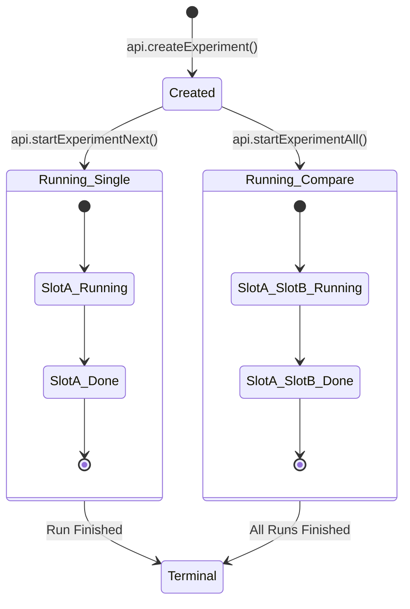

# Experiment Lifecycle State Machine

This document defines the definitive state transitions for an Experiment and its Runs.

## 1. High-Level States

## 2. Detailed Transitions

### Phase 1: Creation (Atomic)
- **Input**: File + Use Case + Candidates (1 or 2)
- **Action**: `POST /api/experiments`
- **Side Effect**:
    - Backend creates Experiment container.
    - Slots (A, B) assigned deterministically based on input array order.
    - Runs initialized as `QUEUED`.
- **Invariants**:
    - Experiment ID is immutable.
    - Candidate configuration is frozen (Snapshot).

### Phase 2: Execution (Mode Deterministic)

#### Single Mode (1 Candidate)
- **Action**: `POST /api/experiments/{id}/runs/start`
- **Logic**: Starts the *next* available `QUEUED` slot (Slot A).
- **Constraint**: MUST NOT be called if >1 candidate exists (Contract Violation).
- **Transition**: Slot A `QUEUED` -> `RUNNING`.

#### Compare Mode (2 Candidates)
- **Action**: `POST /api/experiments/{id}/runs/start-all`
- **Logic**: Starts ALL `QUEUED` slots (Slot A and Slot B) concurrently/sequentially.
- **Transition**: Slot A & B `QUEUED` -> `RUNNING`.

### Phase 3: Termination
- **Trigger**: Runner completes processing (Success/Failure).
- **Transition**: `RUNNING` -> `COMPLETED` | `FAILED`.
- **Artifacts**: Results become available at `/runs/{run_id}`.

## 3. Failure Handling
- **Creation Fail**: 400 (Invalid Candidate) | 500 (IO Error). No Experiment created.
- **Start Fail**: 404 (Exp Not Found). No transition.
- **Run Fail**: Status becomes `FAILED`. Experiment is Terminal but partial results may exist.
